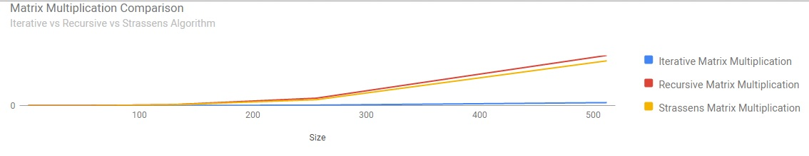

## Matrix Multiplication

### Description
This program implements 3 types of Matrix Multiplication techniques:
* Iterative Matrix Multiplication
* Standard Recursive Matrix Multiplication
* Matrix Multiplication using Strassens Algorithm

The program also compares the running time of both algorithms. As expected, the Strassens algorithm runs faster for larger matrix sizes.

That is,
```cmd
Standard Recursive matrix multiplication takes:
T(n) = O(n^3) time.

Strassens algorithm takes:
T(n) = O(n^lg7) = O(n^2.81) time. [Here lg x = Log to base 2 of x]
```

### Requirements

To execute the program, you need to specify the size (N) of the Square Matrix (N x N).
The matrices A,B used for multiplication are auto-generated (N x N each).
```Note: Currently, the program only supports matrix of sizes that are power of 2. i.e. N = 2^k```


### Usage

```cmd
usage: matrix_multiply.py [-h] SIZE

positional arguments:
  SIZE        Size of Square Matrix for Multiplication. SIZE = 2^k

optional arguments:
  -h, --help  show this help message and exit
```


### Output
The program generates an output file and stores it in the "output" directory for you.
If the input size provided is 16, the program will perform matrix multiplication for all sizes
that are powers of 2, less than 16. i.e. [2, 4, 8, 16].

It then compares running times of all 3 algorithms and logs it into a csv file (graph_input.csv).
This csv file is then used to plot a comparison graph (matrix_mult_charts.html).

### Sample Output

```cmd
$ python matrix_multiply.py 16

WORKING ON MATRIX MULTIPLICATION FOR SIZE [ 2 x 2 ]
     a. Iterative Matrix Multiplication...  DONE!!
     b. Recrusive Matrix Multiplication...  DONE!!
     c. Strassens Matrix Multiplication...  DONE!!
WORKING ON MATRIX MULTIPLICATION FOR SIZE [ 4 x 4 ]
     a. Iterative Matrix Multiplication...  DONE!!
     b. Recrusive Matrix Multiplication...  DONE!!
     c. Strassens Matrix Multiplication...  DONE!!
WORKING ON MATRIX MULTIPLICATION FOR SIZE [ 8 x 8 ]
     a. Iterative Matrix Multiplication...  DONE!!
     b. Recrusive Matrix Multiplication...  DONE!!
     c. Strassens Matrix Multiplication...  DONE!!
WORKING ON MATRIX MULTIPLICATION FOR SIZE [ 16 x 16 ]
     a. Iterative Matrix Multiplication...  DONE!!
     b. Recrusive Matrix Multiplication...  DONE!!
     c. Strassens Matrix Multiplication...  DONE!!
```


### Sample from output file (output/matrix_mult.out)
```cmd
#############################################################################
# MATRIX MULTIPLICATION FOR SIZE [ 2 x 2 ]
#############################################################################
matrixA: [ 2 x 2 ] ==>
  0  1
0[9, 7]
1[1, 3]

matrixB: [ 2 x 2 ] ==>
  0  1
0[3, 3]
1[7, 5]

Iterative Multiplication Result: [ 2 x 2 ] ==>
  0  1
0[76, 62]
1[24, 18]

Iterative Matrix Multiplication:
--- 0.0 seconds ---

Recursive Multiplication Result: [ 2 x 2 ] ==>
  0  1
0[76, 62]
1[24, 18]

Standard Recursive Matrix Multiplication:
--- 0.0 seconds ---

Strassens Multiplication: [ 2 x 2 ] ==>
  0  1
0[76, 62]
1[24, 18]

Strassens Matrix Multiplication:
--- 0.0 seconds ---
#############################################################################
# MATRIX MULTIPLICATION FOR SIZE [ 4 x 4 ]
#############################################################################
matrixA: [ 4 x 4 ] ==>
  0  1  2  3
0[5, 3, 1, 1]
1[4, 1, 1, 4]
2[3, 3, 6, 2]
3[4, 1, 3, 2]

matrixB: [ 4 x 4 ] ==>
  0  1  2  3
0[6, 7, 3, 3]
1[6, 7, 7, 4]
2[3, 4, 1, 4]
3[3, 7, 7, 9]

Iterative Multiplication Result: [ 4 x 4 ] ==>
  0  1  2  3
0[54, 67, 44, 40]
1[45, 67, 48, 56]
2[60, 80, 50, 63]
3[45, 61, 36, 46]

Iterative Matrix Multiplication:
--- 0.0 seconds ---

Recursive Multiplication Result: [ 4 x 4 ] ==>
  0  1  2  3
0[54, 67, 44, 40]
1[45, 67, 48, 56]
2[60, 80, 50, 63]
3[45, 61, 36, 46]

Standard Recursive Matrix Multiplication:
--- 0.0 seconds ---

Strassens Multiplication: [ 4 x 4 ] ==>
  0  1  2  3
0[54, 67, 44, 40]
1[45, 67, 48, 56]
2[60, 80, 50, 63]
3[45, 61, 36, 46]

Strassens Matrix Multiplication:
--- 0.0 seconds ---
#############################################################################
# MATRIX MULTIPLICATION FOR SIZE [ 8 x 8 ]
#############################################################################
matrixA: [ 8 x 8 ] ==>
  0  1  2  3  4  5  6  7
0[7, 5, 4, 5, 7, 2, 4, 1]
1[2, 7, 9, 1, 2, 5, 9, 2]
2[2, 1, 5, 5, 4, 7, 4, 5]
3[8, 4, 3, 3, 6, 5, 7, 2]
4[6, 6, 7, 6, 9, 3, 2, 2]
5[5, 4, 6, 4, 1, 9, 3, 3]
6[3, 7, 4, 4, 5, 5, 4, 1]
7[5, 7, 6, 2, 6, 9, 7, 9]

matrixB: [ 8 x 8 ] ==>
  0  1  2  3  4  5  6  7
0[6, 1, 7, 3, 7, 6, 2, 8]
1[5, 1, 2, 6, 3, 7, 8, 6]
2[9, 7, 3, 3, 7, 9, 4, 9]
3[6, 6, 9, 1, 3, 4, 3, 9]
4[9, 7, 2, 6, 9, 6, 7, 2]
5[4, 4, 7, 8, 6, 4, 3, 2]
6[6, 4, 7, 5, 8, 8, 5, 3]
7[4, 7, 9, 3, 9, 9, 4, 8]

Iterative Multiplication Result: [ 8 x 8 ] ==>
  0  1  2  3  4  5  6  7
0[232, 150, 181, 149, 223, 224, 164, 205]
1[234, 162, 184, 179, 239, 268, 181, 205]
2[200, 175, 206, 147, 222, 213, 136, 186]
3[237, 155, 214, 177, 256, 245, 169, 201]
4[278, 194, 200, 175, 260, 265, 196, 247]
5[203, 151, 210, 163, 215, 221, 139, 207]
6[206, 140, 165, 160, 198, 210, 164, 178]
7[299, 235, 290, 247, 349, 350, 236, 277]

Iterative Matrix Multiplication:
--- 0.000999927520752 seconds ---

Recursive Multiplication Result: [ 8 x 8 ] ==>
  0  1  2  3  4  5  6  7
0[232, 150, 181, 149, 223, 224, 164, 205]
1[234, 162, 184, 179, 239, 268, 181, 205]
2[200, 175, 206, 147, 222, 213, 136, 186]
3[237, 155, 214, 177, 256, 245, 169, 201]
4[278, 194, 200, 175, 260, 265, 196, 247]
5[203, 151, 210, 163, 215, 221, 139, 207]
6[206, 140, 165, 160, 198, 210, 164, 178]
7[299, 235, 290, 247, 349, 350, 236, 277]

Standard Recursive Matrix Multiplication:
--- 0.00100016593933 seconds ---

Strassens Multiplication: [ 8 x 8 ] ==>
  0  1  2  3  4  5  6  7
0[232, 150, 181, 149, 223, 224, 164, 205]
1[234, 162, 184, 179, 239, 268, 181, 205]
2[200, 175, 206, 147, 222, 213, 136, 186]
3[237, 155, 214, 177, 256, 245, 169, 201]
4[278, 194, 200, 175, 260, 265, 196, 247]
5[203, 151, 210, 163, 215, 221, 139, 207]
6[206, 140, 165, 160, 198, 210, 164, 178]
7[299, 235, 290, 247, 349, 350, 236, 277]

Strassens Matrix Multiplication:
--- 0.000999927520752 seconds ---
#############################################################################
# MATRIX MULTIPLICATION FOR SIZE [ 16 x 16 ]
#############################################################################
matrixA: [ 16 x 16 ] ==>
  0  1  2  3  4  5  6  7  8  9  10  11  12  13  14  15
0[5, 5, 3, 7, 8, 8, 2, 5, 2, 1, 9, 7, 1, 7, 7, 1]
1[3, 9, 2, 9, 7, 7, 9, 4, 2, 9, 2, 1, 3, 3, 7, 1]
2[3, 5, 1, 8, 5, 5, 1, 9, 7, 6, 1, 2, 9, 9, 1, 3]
3[7, 2, 7, 7, 3, 3, 9, 7, 6, 5, 8, 2, 2, 9, 7, 5]
4[9, 4, 3, 3, 1, 1, 8, 8, 8, 4, 4, 2, 6, 8, 9, 5]
5[4, 7, 3, 9, 7, 4, 2, 5, 5, 7, 8, 8, 7, 5, 1, 5]
6[7, 5, 9, 4, 1, 2, 4, 6, 9, 7, 6, 7, 5, 3, 4, 4]
7[9, 1, 6, 6, 1, 5, 1, 4, 3, 4, 1, 9, 7, 7, 8, 5]
8[3, 1, 7, 6, 4, 8, 8, 3, 1, 6, 2, 9, 6, 4, 8, 8]
9[3, 8, 4, 5, 5, 9, 1, 2, 8, 7, 3, 6, 9, 5, 7, 4]
10[6, 8, 8, 2, 3, 8, 4, 3, 8, 8, 6, 6, 3, 6, 2, 9]
11[7, 9, 6, 6, 6, 1, 8, 7, 4, 8, 5, 6, 7, 2, 5, 6]
12[1, 7, 4, 4, 6, 3, 3, 8, 9, 4, 6, 8, 2, 1, 9, 2]
13[8, 7, 6, 4, 4, 3, 3, 2, 2, 2, 2, 8, 3, 9, 6, 6]
14[1, 7, 3, 6, 7, 9, 2, 3, 6, 8, 8, 7, 2, 2, 4, 1]
15[7, 6, 5, 2, 3, 7, 1, 4, 2, 8, 8, 6, 9, 1, 4, 5]

matrixB: [ 16 x 16 ] ==>
  0  1  2  3  4  5  6  7  8  9  10  11  12  13  14  15
0[2, 6, 6, 1, 4, 1, 4, 5, 2, 4, 3, 1, 7, 5, 8, 8]
1[9, 9, 7, 8, 3, 1, 8, 4, 2, 7, 9, 1, 2, 5, 7, 5]
2[4, 3, 1, 7, 6, 8, 8, 7, 8, 5, 2, 9, 7, 1, 1, 2]
3[5, 9, 6, 9, 8, 9, 4, 8, 6, 8, 9, 4, 2, 9, 2, 1]
4[2, 7, 1, 1, 1, 2, 5, 9, 5, 8, 9, 7, 5, 9, 5, 1]
5[5, 5, 6, 5, 4, 5, 7, 3, 6, 6, 7, 1, 5, 4, 3, 8]
6[2, 5, 1, 4, 4, 2, 3, 5, 2, 1, 6, 7, 8, 2, 1, 3]
7[7, 3, 4, 9, 7, 7, 3, 8, 3, 3, 8, 9, 6, 4, 9, 2]
8[8, 8, 6, 1, 9, 7, 3, 3, 7, 9, 2, 8, 2, 9, 4, 2]
9[7, 6, 3, 8, 9, 9, 6, 9, 8, 6, 4, 9, 1, 5, 2, 9]
10[8, 9, 9, 8, 3, 8, 8, 3, 3, 4, 8, 6, 5, 8, 8, 1]
11[4, 6, 6, 7, 8, 5, 2, 3, 8, 8, 5, 6, 4, 1, 6, 9]
12[2, 2, 7, 8, 7, 2, 9, 8, 5, 5, 4, 6, 8, 3, 6, 7]
13[5, 9, 1, 1, 8, 9, 6, 4, 9, 3, 9, 6, 5, 9, 5, 8]
14[6, 2, 2, 4, 8, 5, 4, 8, 4, 9, 4, 6, 7, 2, 3, 9]
15[4, 8, 1, 2, 4, 8, 7, 4, 7, 9, 9, 9, 9, 1, 4, 1]

Iterative Multiplication Result: [ 16 x 16 ] ==>
  0  1  2  3  4  5  6  7  8  9  10  11  12  13  14  15
0[403, 500, 355, 406, 425, 430, 413, 427, 401, 469, 528, 408, 385, 427, 393, 378]
1[401, 476, 313, 438, 440, 396, 417, 490, 378, 460, 510, 423, 361, 399, 314, 385]
2[390, 468, 332, 405, 480, 437, 411, 455, 423, 441, 490, 446, 350, 432, 372, 359]
3[449, 547, 340, 439, 533, 537, 463, 506, 464, 482, 542, 556, 480, 451, 395, 392]
4[418, 480, 331, 387, 517, 446, 421, 472, 408, 457, 475, 507, 464, 395, 404, 416]
5[451, 574, 415, 498, 506, 495, 485, 496, 476, 536, 569, 508, 404, 467, 432, 393]
6[439, 492, 372, 456, 521, 480, 443, 462, 452, 491, 443, 521, 415, 379, 390, 393]
7[351, 428, 321, 390, 503, 436, 402, 443, 446, 472, 427, 440, 424, 326, 357, 453]
8[372, 463, 306, 445, 505, 473, 448, 490, 480, 510, 501, 518, 476, 319, 327, 440]
9[452, 516, 394, 455, 526, 462, 494, 486, 486, 562, 507, 479, 409, 422, 387, 467]
10[477, 578, 381, 448, 515, 519, 518, 461, 510, 545, 536, 533, 450, 417, 408, 435]
11[461, 554, 391, 521, 530, 475, 503, 559, 459, 544, 563, 564, 482, 419, 440, 426]
12[441, 458, 345, 428, 468, 426, 381, 440, 396, 503, 460, 480, 360, 376, 375, 347]
13[355, 470, 292, 350, 434, 395, 405, 404, 414, 454, 465, 411, 404, 339, 358, 405]
14[429, 493, 368, 438, 435, 433, 418, 421, 415, 488, 482, 425, 319, 410, 347, 368]
15[396, 449, 384, 457, 440, 409, 471, 443, 404, 465, 453, 438, 408, 338, 395, 418]

Iterative Matrix Multiplication:
--- 0.000999927520752 seconds ---

Recursive Multiplication Result: [ 16 x 16 ] ==>
  0  1  2  3  4  5  6  7  8  9  10  11  12  13  14  15
0[403, 500, 355, 406, 425, 430, 413, 427, 401, 469, 528, 408, 385, 427, 393, 378]
1[401, 476, 313, 438, 440, 396, 417, 490, 378, 460, 510, 423, 361, 399, 314, 385]
2[390, 468, 332, 405, 480, 437, 411, 455, 423, 441, 490, 446, 350, 432, 372, 359]
3[449, 547, 340, 439, 533, 537, 463, 506, 464, 482, 542, 556, 480, 451, 395, 392]
4[418, 480, 331, 387, 517, 446, 421, 472, 408, 457, 475, 507, 464, 395, 404, 416]
5[451, 574, 415, 498, 506, 495, 485, 496, 476, 536, 569, 508, 404, 467, 432, 393]
6[439, 492, 372, 456, 521, 480, 443, 462, 452, 491, 443, 521, 415, 379, 390, 393]
7[351, 428, 321, 390, 503, 436, 402, 443, 446, 472, 427, 440, 424, 326, 357, 453]
8[372, 463, 306, 445, 505, 473, 448, 490, 480, 510, 501, 518, 476, 319, 327, 440]
9[452, 516, 394, 455, 526, 462, 494, 486, 486, 562, 507, 479, 409, 422, 387, 467]
10[477, 578, 381, 448, 515, 519, 518, 461, 510, 545, 536, 533, 450, 417, 408, 435]
11[461, 554, 391, 521, 530, 475, 503, 559, 459, 544, 563, 564, 482, 419, 440, 426]
12[441, 458, 345, 428, 468, 426, 381, 440, 396, 503, 460, 480, 360, 376, 375, 347]
13[355, 470, 292, 350, 434, 395, 405, 404, 414, 454, 465, 411, 404, 339, 358, 405]
14[429, 493, 368, 438, 435, 433, 418, 421, 415, 488, 482, 425, 319, 410, 347, 368]
15[396, 449, 384, 457, 440, 409, 471, 443, 404, 465, 453, 438, 408, 338, 395, 418]

Standard Recursive Matrix Multiplication:
--- 0.00999999046326 seconds ---

Strassens Multiplication: [ 16 x 16 ] ==>
  0  1  2  3  4  5  6  7  8  9  10  11  12  13  14  15
0[403, 500, 355, 406, 425, 430, 413, 427, 401, 469, 528, 408, 385, 427, 393, 378]
1[401, 476, 313, 438, 440, 396, 417, 490, 378, 460, 510, 423, 361, 399, 314, 385]
2[390, 468, 332, 405, 480, 437, 411, 455, 423, 441, 490, 446, 350, 432, 372, 359]
3[449, 547, 340, 439, 533, 537, 463, 506, 464, 482, 542, 556, 480, 451, 395, 392]
4[418, 480, 331, 387, 517, 446, 421, 472, 408, 457, 475, 507, 464, 395, 404, 416]
5[451, 574, 415, 498, 506, 495, 485, 496, 476, 536, 569, 508, 404, 467, 432, 393]
6[439, 492, 372, 456, 521, 480, 443, 462, 452, 491, 443, 521, 415, 379, 390, 393]
7[351, 428, 321, 390, 503, 436, 402, 443, 446, 472, 427, 440, 424, 326, 357, 453]
8[372, 463, 306, 445, 505, 473, 448, 490, 480, 510, 501, 518, 476, 319, 327, 440]
9[452, 516, 394, 455, 526, 462, 494, 486, 486, 562, 507, 479, 409, 422, 387, 467]
10[477, 578, 381, 448, 515, 519, 518, 461, 510, 545, 536, 533, 450, 417, 408, 435]
11[461, 554, 391, 521, 530, 475, 503, 559, 459, 544, 563, 564, 482, 419, 440, 426]
12[441, 458, 345, 428, 468, 426, 381, 440, 396, 503, 460, 480, 360, 376, 375, 347]
13[355, 470, 292, 350, 434, 395, 405, 404, 414, 454, 465, 411, 404, 339, 358, 405]
14[429, 493, 368, 438, 435, 433, 418, 421, 415, 488, 482, 425, 319, 410, 347, 368]
15[396, 449, 384, 457, 440, 409, 471, 443, 404, 465, 453, 438, 408, 338, 395, 418]

Strassens Matrix Multiplication:
--- 0.00899982452393 seconds ---
```

### Sample Graph Plot
